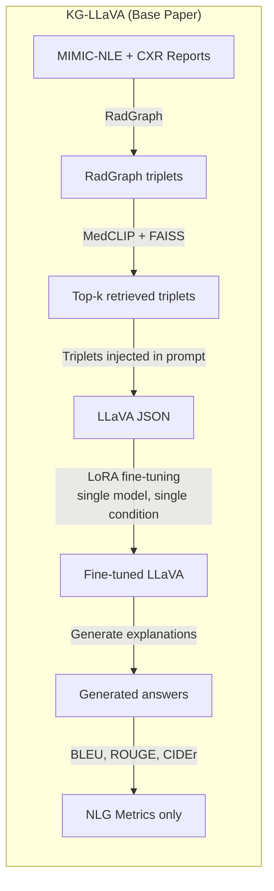
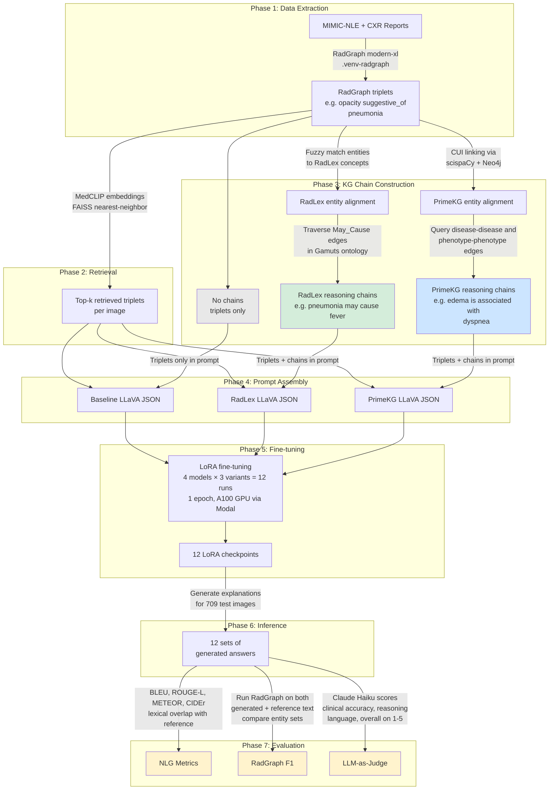

Base paper workflow

Our approach

Model                       | Backbone  | Scale | Domain
-------------------- |-----------|-------|----------
LLaVA-1.5-7B      | LLaMA     |  7B   | General
LLaVA-1.6-7B      | Vicuna    |  7B   | General
LLaVA-1.6-13B     | Vicuna    | 13B   | General
LLaVA-Med-7B      | Mistral   |  7B   | Biomedical
